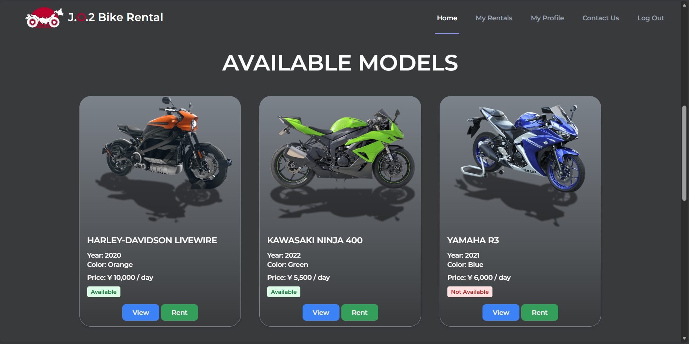
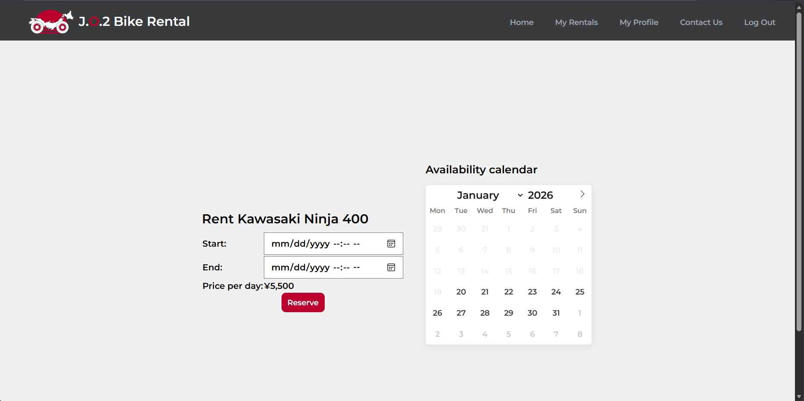
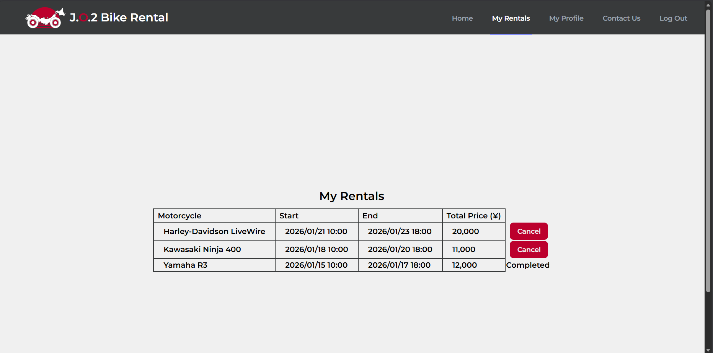
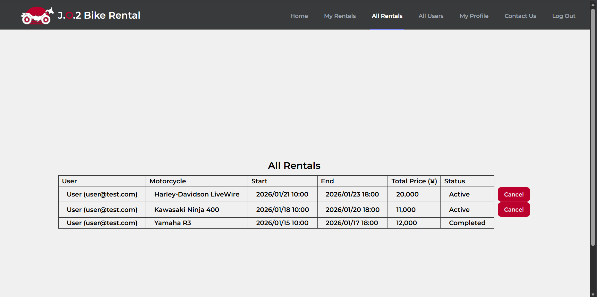

# Motorcycle Rental Web Application

**Live Demo:**
https://motorcycle-rental-production.up.railway.app/motorcycles

 **Demo Accounts:**
- Admin: `admin@test.com` / `test123`
- User: `user@test.com` / `test123`

A web application that lets users browse, reserve, and manage motorcycle rentals in Japan.

The system includes user authentication, role-based authorization, and an admin dashboard
for managing rentals and users. This project was created as a portfolio application to
show backend development skills using Laravel and MySQL.

## Features

### User
- Register and log in
- Browse available motorcycles
- View motorcycle details
- Rent a motorcycle by selecting date range
- View rental history from "My Rentals"
- Cancel active rentals
- View profile and rental summary

### Admin
- Manage motorcycles (create, edit, delete)
- View all rentals
- Cancel any rental
- View all users
- Change user roles (admin / user)

## Tech Stack

- **Backend:** PHP 8.3, Laravel 12
- **Database:** MySQL
- **Frontend:** Blade templates, Tailwind CSS
- **Authentication:** Laravel Breeze
- **Authorization:** Custom admin middleware
- **Environment:** Local development (Docker / Laravel)

## Screenshots

### Home (Motorcycle List)


### Rent Motorcycle


### My Rentals


### Admin - All Rentals


## Installation (Local)

```bash
git clone https://github.com/OmarCasado/motorcycle-rental.git
cd motorcycle-rental
composer install
cp .env.example .env
php artisan key:generate
```

Configure your database credentials in the `.env` file, then run:

```bash
php artisan migrate:fresh --seed
php artisan serve
```

The application will be available at:

```
http://localhost:8000
```


## Demo Accounts

You can use the following accounts to test the application:

| Role  | Email            | Password |
|------|------------------|----------|
| Admin | admin@test.com   | test123  |
| User  | user@test.com    | test123  |


## Notes

- This project focuses on backend logic, data consistency, and role-based authorization.
- UI/UX and non-essential features were intentionally kept simple.
- The database can be fully recreated using `php artisan migrate:fresh --seed`.


## License

This project is for educational and portfolio purposes.